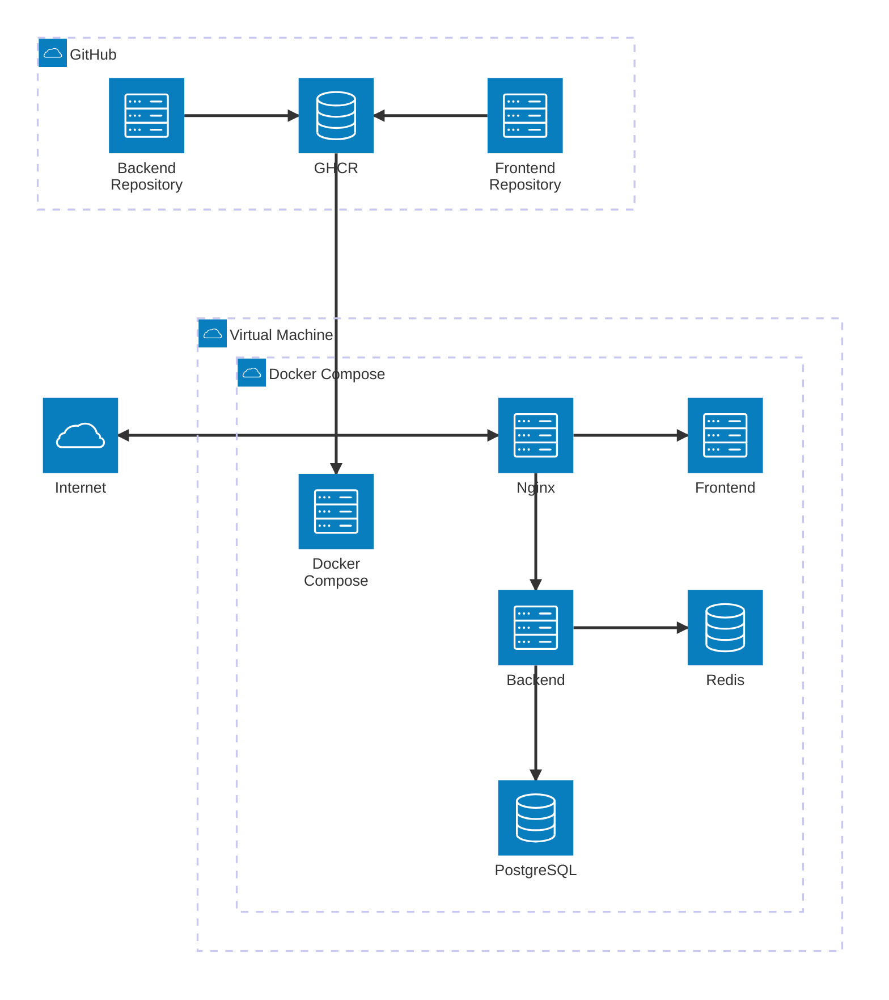

# Neswear Deployment

Deployment and CI/CD configuration for the Neswear e-commerce platform.

## Architecture

## Tech Stack

- Azure VM
- Docker & Docker Compose
- Nginx
- GitHub Actions
- GHCR
- PostgreSQL
- Redis
- Certbot

## Services

- Frontend: Next.js (GHCR image)
- Backend: NestJS (GHCR image)
- Database: PostgreSQL
- Cache / Queue: Redis
- Reverse proxy: Nginx

## Deployment

### Deploy

- Pull the latest Docker images
- Start/restart the containers

### Seed Database

- Run the database seed script manually

Both workflows use `workflow_dispatch`, so they can be run from **GitHub Actions → Run workflow**.

## CI/CD

The backend and frontend repositories have their own CI workflows to build and push Docker images to GHCR.

The deployment repository provides a manual GitHub Actions workflow to pull the latest images and deploy them to the Azure VM.

## HTTPS

Nginx handles HTTPS traffic using Let's Encrypt certificates managed by Certbot.

## Related Repositories

- [Neswear Backend](https://github.com/levanvux/neswear-backend)
- [Neswear Frontend](https://github.com/levanvux/neswear-frontend)
